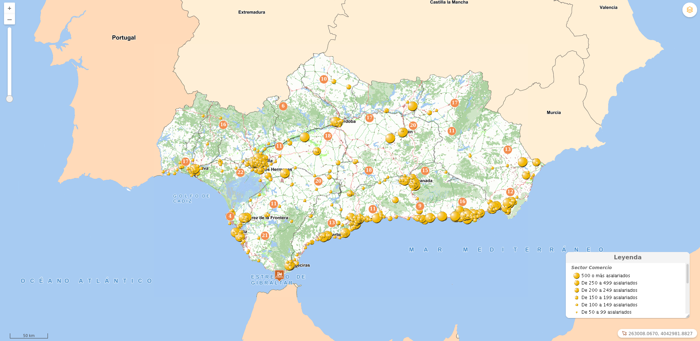

# InputSelectAddLayer

[](https://github.com/sigcorporativo-ja/Mapea4-dev-webpack)

## Descripción

 Plugin de [Mapea](https://github.com/sigcorporativo-ja/Mapea4) para la generación de una leyenda simple.

 En función de la configuración suministrada el plugin podrá ser draggable y contener uno o mas Layers de mapea tanto ***Raster*** como ***Vectoriales**:
 




Previamente a la definición de los parámetros de configuración del plugin los layers a cargar en la leyenda deben de haberse definido y cargados en Mapea.

En la [Wiki de Mapea](https://github.com/sigcorporativo-ja/Mapea4/wiki/Capas) viene detallada cada una de las definiciones de los diferentes tipos de Layers

Para el correcto funcionamiento del plugin es necesario pasarle en su constructor un objeto **json** con los parámetros esperados.
### Parámetros del plugin


- ### Definición Layers de Mapea ###

Antes de generar la configuración del plugin es necesario tener definidos los layers que se desean cargar.

El plugin admite el uso tanto de layer ___Raster___ como ___Vectoriales___
```javascript

//DEFINICION DE LAYERS

let layer = new M.layer.WMS({
  url: 'http://www.juntadeandalucia.es/institutodeestadisticaycartografia/geoserver-ieca/direst/wms?',
  name: 'direst_comercio_2018',
  legend: 'Sector Comercio',
  transparent: true
}, {
  params: {
    styles: 'direst_comercio',
    layers: 'direst_comercio_2018',
  }
});

let layer1 = new M.layer.WMS({
  url: 'http://www.juntadeandalucia.es/institutodeestadisticaycartografia/geoserver-ieca/direst/wms?',
  name: 'direst_transporte_2018',
  legend: 'Sector Transporte y almacenamiento',
  transparent: true
}, {
  params: {
    styles: 'direst_transporte',
    layers: 'direst_transporte_2018',
  }
});

let layer2 = new M.layer.WMS({
  url: 'http://www.juntadeandalucia.es/institutodeestadisticaycartografia/geoserver-ieca/direst/wms?',
  name: 'direst_construccion_2018',
  legend: 'Sector Construccion',
  transparent: true
}, {
  params: {
    styles: 'direst_construccion',
    layers: 'direst_construccion_2018',
  }
});
```

- ### Ejemplo simpleLegend un layer ###

```javascript
const configSimpleLegend1 = {
  title: 'Leyenda',
  draggable: true,
  layers: [layer]
}
```

- ### Ejemplo simpleLegend varios layers ###
```javascript
const configSimpleLegend2 = {
  title: 'Leyenda',
  draggable: true,
  layers: [layer, layer1, layer2]
}
```


- **title [string]:**  Texto a mostrar en la cabecera de la leyenda.
- **draggable [boolean]:**  Solo admite valores _True_ o _False_ en caso de ser _True_  el usuario podra mover la leyenda por todo el mapa
- **layers [array]:** Array de Layers de Mapea. Estos pueden ser tanto Raster como Vectoriales.

      

## Metodos

El plugin cuenta con el método ***updateLegend(Layers)*** el cual permite actualizar la leyenda en tiempo de ejecución. Este método recive como parámetro un Objeto  Layer de Mapea o un Array de Layers de Mapea.

```javascript

mp.updateLegend(layer)

mp.updateLegend([layer, layer1, Layer2])
```

## Eventos 

El plugin expone un evento

- ***M.evt.ADDED_TO_MAP:*** Se dispara cuando se carga el control del plugin 


## Recursos y configuración

- js: inputselectaddlayer.ol.min.js
- css: inputselectaddlayer.min.css

```javascript

//DEFINICION DE LAYERS
let layer = new M.layer.WMS({
  url: 'http://www.juntadeandalucia.es/institutodeestadisticaycartografia/geoserver-ieca/direst/wms?',
  name: 'direst_comercio_2018',
  legend: 'Sector Comercio',
  transparent: true
}, {
  params: {
    styles: 'direst_comercio',
    layers: 'direst_comercio_2018',
  }
});

let layer1 = new M.layer.WMS({
  url: 'http://www.juntadeandalucia.es/institutodeestadisticaycartografia/geoserver-ieca/direst/wms?',
  name: 'direst_transporte_2018',
  legend: 'Sector Transporte y almacenamiento',
  transparent: true
}, {
  params: {
    styles: 'direst_transporte',
    layers: 'direst_transporte_2018',
  }
});

let layer2 = new M.layer.WMS({
  url: 'http://www.juntadeandalucia.es/institutodeestadisticaycartografia/geoserver-ieca/direst/wms?',
  name: 'direst_construccion_2018',
  legend: 'Sector Construccion',
  transparent: true
}, {
  params: {
    styles: 'direst_construccion',
    layers: 'direst_construccion_2018',
  }
});


// DEFINICION CONFIGURACIÓN PLUGIN
const configSimpleLegend1 = {
  title: 'Leyenda',
  draggable: true,
  layers: [layer
  ]
}

map.addLayers([layer]);
const mp = new Simplelegend(configSimpleLegend1);

map.addPlugin(mp);

// TEST  EVENTO
mp.on(M.evt.ADDED_TO_MAP, () => {
  console.log('se cargo el plugin');
})

// TEST ACTUALIZACIÓN 

setTimeout(() => {
  map.removeLayers(layer)
  map.addLayers([layer1, layer2]);
  mp.updateLegend([layer1, layer2]);
}
  , 8000);


```

## Visor Demo
Para comprobar el funcionamiento de este plugin se puede acceder al siguiente enlace [Ejemplo Visor](https://emiliopardo.github.io/simplelegend/).
## Video Demo

Para comprobar el funcionamiento de este plugin se puede descargar el [Video](https://github.com/emiliopardo/simplelegend/blob/master/docs/video/simpleLegend.webm?raw=true) el cual contempla la configuración y carga del plugin.
